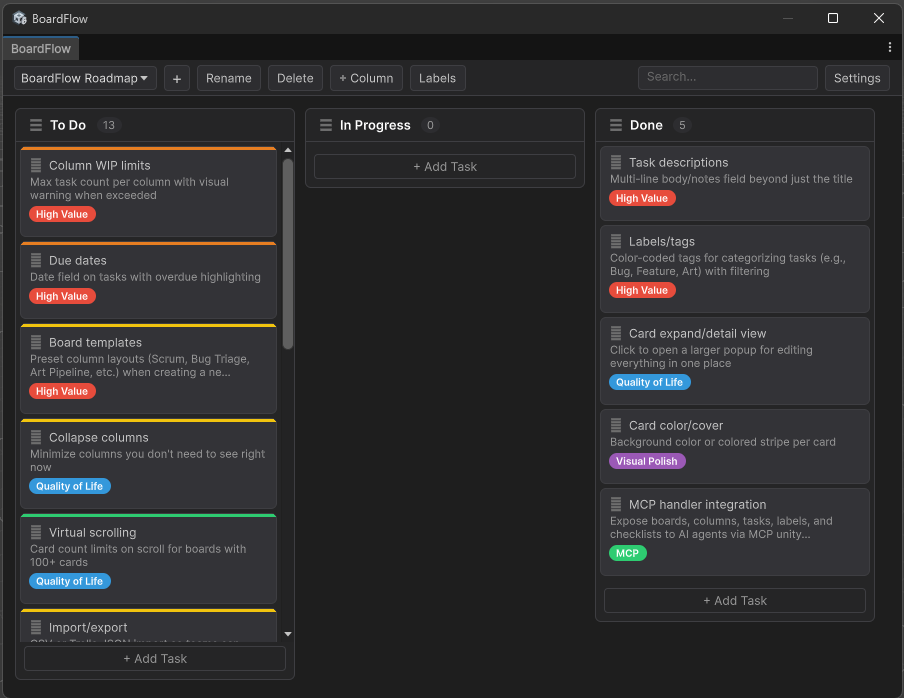

# BoardFlow

A Kanban-style project task tracker built directly into the Unity Editor. Keep your task management inside the editor instead of switching to external tools.

 



## Features

- **Multiple Boards** - Create and switch between separate boards for different workflows
- **Customizable Columns** - Add, rename, reorder, and delete columns to match your process
- **Task Cards** - Create tasks with editable titles, descriptions, priority levels, and checklists
- **Labels/Tags** - Color-coded board-level labels for categorizing tasks, assignable via context menu or detail view
- **Card Detail View** - Click a card to open a full editing window with title, priority, labels, description, and checklist
- **Drag & Drop** - Reorder cards within and across columns, and reorder columns themselves
- **Card Colors** - Per-card color with two display modes: colored stripe bar or translucent background tint
- **Priority Levels** - None, Low, Medium, High, and Critical with colored indicator bars
- **Checklists** - Add checklist items to tasks with toggleable checkboxes and progress bars
- **Inline Editing** - Double-click any title or checklist item to edit in place
- **Search & Filter** - Filter cards in real-time across all columns by title, description, or label name
- **Undo/Redo** - Full integration with Unity's Ctrl+Z / Ctrl+Y
- **Persistent Data** - Saved as JSON in `ProjectSettings/BoardFlow/`, version-control friendly
- **Column WIP Limits** - Set max task counts per column with orange/red visual warnings when at or over limit
- **Collapse Columns** - Minimize columns to a narrow strip with a chevron toggle to save screen space
- **Column Sorting** - Sort cards by priority, creation date, or alphabetically via column context menu
- **Custom Fields** - Define board-level custom fields and set string values per task in the detail view
- **Board Statistics** - View task counts, priority breakdown, checklist progress, and label usage from the toolbar
- **Multiple Selection** - Ctrl+click to toggle, Shift+click to range-select, then bulk delete or move via context menu
- **Notification Dot** - Window tab shows a warning icon when Critical priority tasks exist on the active board
- **MCP Integration** - Expose boards, columns, tasks, labels, and checklists to AI agents via the Model Context Protocol (MCP) unity-plugin
- **Dark Theme** - Styled to match the Unity editor skin

## Installation

### Git URL (recommended)

1. Open **Window > Package Manager** in Unity
2. Click **+** > **Add package from git URL...**
3. Enter: `https://github.com/farmerbob1/boardflow.git`

### Local

1. Clone or download this repository into your project's `Packages/` folder as `com.boardflow`

## Usage

Open the board from the menu: **Window > BoardFlow**

### Keyboard Shortcuts

| Shortcut | Action |
|----------|--------|
| `Ctrl+N` | New board |
| `Ctrl+F` | Focus search field |
| `Ctrl+Click` | Toggle card selection |
| `Shift+Click` | Range-select cards in a column |
| `Escape` | Clear selection / search / unfocus |
| `Delete` | Open bulk action menu (when cards selected) |

### Editing

- **Single-click** a card to open the detail view for full editing (title, priority, labels, description, checklist)
- **Double-click** a column title, task title, or checklist item to edit it inline
- **Right-click** a column header for rename/delete, WIP limit, and sort options
- **Right-click** a task card to set priority, set card color, assign labels, edit title, manage checklist items, or delete
- **Right-click** with multiple cards selected for bulk delete or move operations
- Use the **Labels** toolbar button to create, edit, and delete board-level labels
- Use the **Fields** toolbar button to manage custom fields for the board
- Use the **Stats** toolbar button to view board statistics

### Drag & Drop

- Drag cards by the `⠇` handle to reorder within a column or move between columns
- Drag columns by the `☰` handle in the header to reorder them

## Package Structure

```
com.boardflow/
  package.json
  Editor/
    BoardFlowWindow.cs           # Main EditorWindow
    Data/                         # Serializable data model classes
    Services/                     # JSON persistence and undo system
    UI/                           # Visual element classes
    DragDrop/                     # Drag manipulators and state
    McpHandlers/                  # MCP command handlers for AI agent integration
    Styles/                       # USS stylesheets
```

## Data Storage

Board data is saved to `ProjectSettings/BoardFlow/boardflow-data.json` as pretty-printed JSON. This location is version-control friendly and shareable across a team without requiring Unity's AssetDatabase.

## MCP Integration

BoardFlow exposes 28 commands to AI agents through the MCP for Unity plugin using a reflection-based discovery approach. No assembly coupling is required — the MCP plugin scans for classes marked with `[McpHandlerGroup]` and calls their `Register` method at startup.

### Available Commands

| Category | Commands |
|----------|----------|
| **Boards** | `boardflow_list_boards`, `boardflow_create_board`, `boardflow_delete_board`, `boardflow_rename_board` |
| **Columns** | `boardflow_list_columns`, `boardflow_create_column`, `boardflow_delete_column`, `boardflow_rename_column` |
| **Tasks** | `boardflow_get_board`, `boardflow_create_task`, `boardflow_delete_task`, `boardflow_update_task`, `boardflow_move_task` |
| **Labels** | `boardflow_create_label`, `boardflow_delete_label`, `boardflow_add_label_to_task`, `boardflow_remove_label_from_task` |
| **Checklists** | `boardflow_add_checklist_item`, `boardflow_toggle_checklist_item`, `boardflow_delete_checklist_item` |
| **Column Settings** | `boardflow_set_column_wip_limit`, `boardflow_set_column_collapsed`, `boardflow_set_column_sort_mode` |
| **Custom Fields** | `boardflow_create_custom_field`, `boardflow_delete_custom_field`, `boardflow_set_custom_field_value` |
| **Statistics** | `boardflow_get_board_statistics` |

### Setup

1. Install the MCP for Unity plugin in your project
2. BoardFlow's handlers are automatically discovered — no additional configuration needed
3. The BoardFlow window auto-refreshes after any MCP command mutates data

## Roadmap (v2)

### High Value
- [x] Task descriptions - Multi-line body/notes field beyond just the title
- [x] Labels/tags - Color-coded tags for categorizing tasks (e.g., "Bug", "Feature", "Art") with filtering
- [x] Column WIP limits - Max task count per column with visual warning when exceeded
- [ ] Due dates - Date field on tasks with overdue highlighting
- [ ] Board templates - Preset column layouts (Scrum, Bug Triage, Art Pipeline, etc.) when creating a new board

### Quality of Life
- [x] Card expand/detail view - Click to open a larger popup for editing everything in one place
- [x] Collapse columns - Minimize columns you don't need to see right now
- [ ] Virtual scrolling - Card count limits on scroll for boards with 100+ cards
- [ ] Import/export - CSV or Trello JSON import so teams can migrate existing boards
- [x] Multiple selection - Shift/Ctrl+click to select multiple cards for bulk move or delete

### Visual Polish
- [x] Card color/cover - Background color or colored stripe per card
- [ ] Assignee avatars - Assign team members to tasks pulled from project contributors
- [ ] Swimlanes - Horizontal grouping rows within the board (by priority, assignee, etc.)
- [x] Column sorting - Sort cards by priority, date created, or alphabetical

### Power User
- [x] Board-level statistics - Small dashboard showing cards per column, completion rate, velocity
- [x] Notification dot on menu item - Show when tasks are overdue
- [x] Custom fields - User-defined key/value pairs on cards for project-specific data

## Requirements

- Unity 6 (6000.0) or later
- [Newtonsoft.Json](https://docs.unity3d.com/Packages/com.unity.nuget.newtonsoft-json@3.2/manual/index.html) (automatically resolved as a package dependency)
- MCP for Unity plugin (optional, for AI agent integration)
